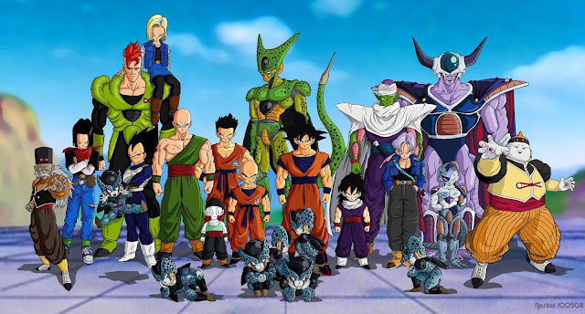
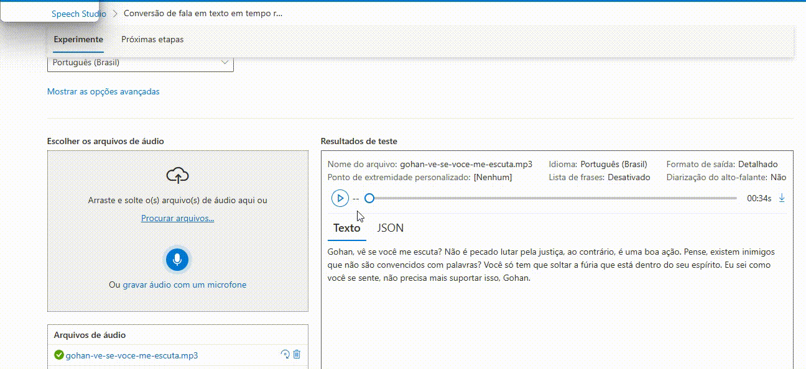
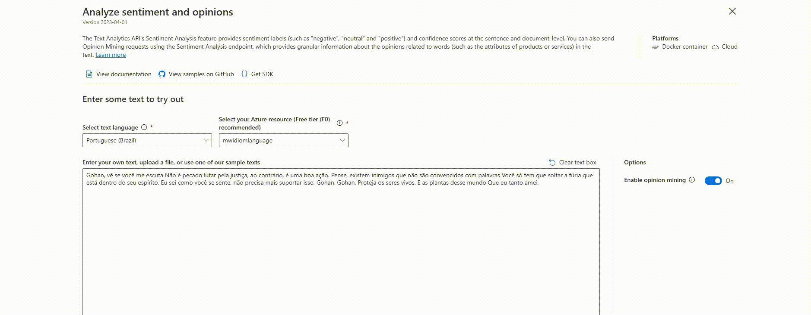

## Análise de Sentimentos com Dragon Ball Z

## 🛠️ Ferramentas utilizadas

 
 

Azure Speech Studio – transcrição de fala para texto.  
Azure Language Studio – análise de sentimentos.  

## 🎯 Objetivo

Este projeto demonstra o uso de IA da Azure (Speech Studio + Language Studio) para analisar sentimentos em falas icônicas do anime Dragon Ball Z.  
Foi utilizada a fala do Android 16 para Gohan como exemplo, transformando a transcrição em uma análise de sentimentos.

  
   
  <em>Figura 1 - Dragon Ball Z - Saga dos Androids & Saga Cell</em>

## 1️⃣ Transcrição da fala com Azure Speech Studio

Depois de criar a conta no Azure e o recurso necessário, acesse o Azure Speech Studio e escolha a função utilizada; nesse caso, será a etapa de **conversão de voz para texto**:

  
   
  <em>Figura 2 — Azure Speech Studio</em>

Após acessar a aba de conversão de voz para texto, realize o upload do áudio e aguarde o resultado da transcrição. Observa-se que o texto é apresentado com a acentuação e a estrutura gramatical que a IA interpreta como corretas:

  
   
  <em>Figura 3 — Transcrição do Azure Speech Studio</em>

  
   
  <em>Figura 4 — Transcrição do Azure Speech Studio</em>

Percebe-se que a IA, ao receber o áudio, interpreta algumas frases do Android 16 como perguntas:

- "Gohan, vê se você me escuta?"  
- "Pense, existem inimigos que não são convencidos com palavras?"  
- "E as plantas desse mundo?"

No episódio, percebemos que ele **não está realmente perguntando nada**. Ele apenas chama a atenção de Gohan durante a luta e faz seu discurso antes de morrer. Essa diferença ocorre porque a IA interpreta o áudio de forma diferente da percepção humana da cena.

  
   
  <em>Figura 5 — Morte de Android 16</em>

## 2️⃣ Análise de Sentimentos com Azure Language Studio

Depois de criar a conta no Azure e o recurso necessário, acesse o **Azure Language Studio** e importe o texto gerado no Speech Studio para realizar a análise de sentimentos:

  
   
  <em>Figura 6 — Análise de Sentimentos</em>

Se seguirmos o mesmo texto que foi gerado na ferramenta anterior e utilizarmos na nossa análise, teremos o seguinte resultado:

  
   
  <em>Figura 7 - Realização da análise de Sentimentos</em>
  <!-- Insira aqui o texto explicativo da Figura 7 -->

O modelo quebra o texto em sentenças para explicar o resultado do gráfico e realiza a busca por palavras-chave para avaliar o conteúdo. Aqui, ele buscou palavras como "plantas" e "amei":

  
   
  <em>Figura 8 - Gráfico gerado com o resultado final da análise</em>
  <!-- Insira aqui o texto explicativo da Figura 8 -->

Segundo a imagem, o texto foi interpretado como algo positivo. Logo, o discurso feito pelo Android 16 foi de grande ajuda para que Gohan desbloqueasse todo o seu poder oculto e enfrentasse Cell.

Agora, será que há diferença nesse resultado ao utilizar o texto **corrigido gramaticalmente**? Após a correção e nova análise na ferramenta, temos:

  
   
  <em>Figura 9 - Nova análise com correção ortográfica</em>
  <!-- Insira aqui o texto explicativo da Figura 9 -->

  
   
  <em>Figura 10 - Resultado das sentenças</em>
  <!-- Insira aqui o texto explicativo da Figura 10 -->

  
   
  <em>Figura 11 - Resultados das sentenças</em>
  <!-- Insira aqui o texto explicativo da Figura 11 -->

  
   
  <em>Figura 12 - Resultados das sentenças</em>
  <!-- Insira aqui o texto explicativo da Figura 12 -->

Percebe-se que o resultado foi alterado. Antes, o modelo interpretava a maioria do texto como positiva, mas após a correção gramatical, o modelo apresenta avaliações negativas.  
Esse resultado mostra  como a **correção gramatical influencia diretamente** o resultado final da análise de sentimentos, mostrando que ajustes no texto podem alterar a interpretação da IA.

